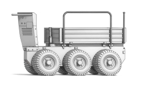

# 시스템 구조



## 전체 아키텍처

```
┌─────────────────────────────────────────────────────────────────┐
│                        ROS2 Network                              │
│                   (Cyclone DDS, Domain ID: 20)                   │
└─────────────────────────────────────────────────────────────────┘
         ↑                    ↑                    ↑
         │                    │                    │
    ┌────┴────┐         ┌────┴────┐         ┌────┴────┐
    │   WSL   │         │   Pi    │         │Linux PC │
    │ Ubuntu  │         │ Ubuntu  │         │ Ubuntu  │
    │  24.04  │         │  24.04  │         │  24.04  │
    │  Jazzy  │         │  Jazzy  │         │  Jazzy  │
    │192.168  │         │192.168  │         │192.168  │
    │  .0.65  │         │ .0.103  │         │ .0.154  │
    └─────────┘         └────┬────┘         └─────────┘
                             │
                    ┌────────┴────────┐
                    │ micro_ros_agent │
                    │  (USB Serial)   │
                    └────────┬────────┘
                             │
                    [USB /dev/ttyUSB0]
                    [921600 baud]
                             │
                    ┌────────┴────────┐
                    │  ESP32-WROOM    │
                    │  (micro-ROS)    │
                    │  YB_Car_Node    │
                    └─────────────────┘
```

## 각 구성 요소 상세

### ESP32-WROOM (micro-ROS)
- **노드**: `/YB_Car_Node`
- **역할**: 로봇 하드웨어 제어 및 센서 데이터 수집
- **통신**: USB Serial → Pi
- **구독 토픽**:
  - `/beep` - 부저 제어
  - `/cmd_vel` - 로봇 속도 명령
  - `/servo_s1`, `/servo_s2` - 서보 제어
- **발행 토픽**:
  - `/battery` - 배터리 전압
  - `/imu` - IMU 센서 데이터
  - `/odom_raw` - 오도메트리
  - `/scan` - 레이저 스캔

### Raspberry Pi (192.168.0.103)
- **OS**: Ubuntu 24.04
- **ROS**: Jazzy
- **DDS**: Cyclone DDS
- **역할**: micro-ROS Agent (ESP32 ↔ ROS2 브릿지)
- **실행 명령**:
  ```bash
  ros2 run micro_ros_agent micro_ros_agent serial --dev /dev/ttyUSB0 -b 921600 -v4
  ```
- **네트워크**:
  - LAN: 192.168.0.103
  - WiFi: 192.168.0.88

### WSL (192.168.0.65)
- **OS**: Ubuntu 24.04
- **ROS**: Jazzy (Humble에서 업그레이드)
- **DDS**: Cyclone DDS
- **역할**: 개발, 모니터링, 테스트

### Linux PC (192.168.0.154)
- **OS**: Ubuntu 24.04
- **ROS**: Jazzy
- **DDS**: Cyclone DDS
- **역할**: 테스트 노드 실행

## 통신 프로토콜

### Layer 1: ESP32 ↔ Pi
- **프로토콜**: micro-XRCE-DDS
- **물리**: USB Serial
- **속도**: 921600 baud

### Layer 2: Pi ↔ ROS2 Network
- **프로토콜**: DDS (Cyclone DDS)
- **물리**: Ethernet/WiFi
- **도메인**: 20

## 네트워크 설정

### 공통 환경 변수
```bash
export ROS_DOMAIN_ID=20
export RMW_IMPLEMENTATION=rmw_cyclonedds_cpp
export ROS_LOCALHOST_ONLY=0
```

### IP 주소
- WSL: 192.168.0.65
- Pi (LAN): 192.168.0.103
- Pi (WiFi): 192.168.0.88
- Linux PC: 192.168.0.154

---
## Yahboom ESP32 로봇 (YB_Car)

### 제품 개요
- **제품명**: MicroROS-Pi5 로봇 카
- **주요 플랫폼**: Raspberry Pi 5 + ESP32-WROOM-32
- **ROS 버전**: ROS2 (Jazzy/Humble) + micro-ROS
- **주요 특징**: 
  - ESP32 기반 실시간 제어 (micro-ROS)
  - Pi5에서 고급 연산 처리 (OpenCV, MediaPipe)
  - LiDAR 기반 매핑/내비게이션
  - 멀티 머신 통신 지원

### 하드웨어 구성
- **메인 보드**: ESP32-WROOM-32
- **통신**: USB Serial (921600 baud) → micro-ROS Agent
  - 포트: `/dev/ttyUSB0`
  - 프로토콜: micro-XRCE-DDS over Serial
- **전원**: 배터리 구동 (전압 모니터링 필요)
- **센서**: IMU, 거리 센서(LiDAR/초음파), 배터리 센서
- **액추에이터**: DC 모터 4개 (차동 구동)

### ROS2 토픽 구조
**발행(Publish) - ESP32 → ROS2:**
- `/battery`: 배터리 전압/상태
- `/imu`: IMU 센서 데이터 (가속도, 자이로)
- `/scan`: 거리 센서 데이터 (LaserScan)
- `/odom`: 오도메트리 정보

**구독(Subscribe) - ROS2 → ESP32:**
- `/cmd_vel`: 속도 명령 (geometry_msgs/Twist)
  - `linear.x`: 전진/후진 속도
  - `angular.z`: 회전 속도

### 기본 제어

**로봇 이동:**
```bash
# 전진
ros2 topic pub -r 10 /cmd_vel geometry_msgs/msg/Twist '{linear: {x: 0.2, y: 0.0, z: 0.0}, angular: {x: 0.0, y: 0.0, z: 0.0}}'

# 정지
ros2 topic pub -1 /cmd_vel geometry_msgs/msg/Twist '{linear: {x: 0.0, y: 0.0, z: 0.0}, angular: {x: 0.0, y: 0.0, z: 0.0}}'

# 좌회전
ros2 topic pub -r 10 /cmd_vel geometry_msgs/msg/Twist '{linear: {x: 0.0, y: 0.0, z: 0.0}, angular: {x: 0.0, y: 0.0, z: 0.5}}'
```

**센서 모니터링:**
```bash
# 배터리 상태
ros2 topic echo /battery

# IMU 데이터
ros2 topic echo /imu

# LiDAR 스캔
ros2 topic echo /scan
```

### ESP32 연결 확인

**정상 상태:**
- `/dev/ttyUSB0` 존재
- micro_ros_agent 로그에 "session created" 메시지
- `ros2 node list`에 `/YB_Car_Node` 표시
- 토픽 데이터 정상 수신

**연결 실패 시:**
1. USB 케이블 재연결
2. ESP32 리셋 버튼 (물리적)
3. Agent 재시작: `sudo systemctl restart micro_ros_agent.service`
4. 로그 확인: `journalctl -u micro_ros_agent.service -n 50`

### 주의사항
- **배터리 전압**: 항상 모니터링 (저전압 시 모터 오작동)
- **통신 끊김**: ESP32 리셋 후 자동 재연결됨
- **속도 제한**: linear.x: [-1.0, 1.0], angular.z: [-2.0, 2.0]
- **Domain ID**: ROS_DOMAIN_ID=20 고정 사용


## 참고 링크

### 공식 문서
- [Yahboom MicroROS-Pi5 공식 문서](https://www.yahboom.net/study/MicroROS-Pi5)
- [Yahboom GitHub 저장소](https://github.com/YahboomTechnology/MicroROS-Car-Pi5)
- [일본어 매뉴얼](https://drive.google.com/drive/folders/1Xd2boZ8CG8Hq_G6zRj8CqsNoueV-Ji3G)
- [ROS2 공식 문서](https://docs.ros.org/en/jazzy/)
- [micro-ROS 공식 문서](https://micro.ros.org/)
- [Cyclone DDS 문서](https://github.com/eclipse-cyclonedds/cyclonedds)

### Yahboom 제공 자료
- [매핑 앱 (iOS/Android)](https://drive.google.com/drive/folders/1f25ErWgtyv9w0pSxEO0E7r575RcmiKlX)
- [소스 코드](https://drive.google.com/drive/folders/16n1kfoHGunD2CuZ_Je-8tCHgshOiDSGN)
- [하드웨어 정보](https://drive.google.com/drive/folders/1Akl4eNcx0iPCiOKzo19IAXzehRkr9kRv)
- [RPi5 이미지 파일](https://drive.google.com/drive/folders/1F01KV97adeSBb8vEu8RBinGPEMQ_-beK)
- [사용 설명서](https://drive.google.com/drive/folders/149OwYRbu-IMPtLTGA-ByAko5b057ybu1)
- [3D 모델 파일](https://drive.google.com/drive/folders/1WfYmjo68-FqdKcWsQCX4LvtkdElk0EB0)
- [VM 이미지 파일](https://drive.google.com/drive/folders/1PiSthykq37ss3N0VTNtiMNR7ecPtRdXH)

### 학습 코스 (공식 사이트)

#### 1. Introduction (제품 소개)
- MicroROS-Pi5 로봇 카 개요
- 하드웨어 스펙 및 구성품 소개
- ESP32 + Raspberry Pi 5 아키텍처 설명
- micro-ROS와 ROS2 통합 개념
- 제품 특징: LiDAR, 카메라, IMU 센서 활용

#### 2. Assembly course (조립 가이드)
- 하드웨어 조립 단계별 가이드
- 섀시, 모터, 휠 조립
- ESP32 제어 보드 장착
- Raspberry Pi 5 마운팅
- 센서(LiDAR, 카메라, IMU) 설치
- 배터리 및 전원 연결
- 케이블 정리 및 최종 점검

#### 3. Preparation (준비 사항)
- Raspberry Pi 5 OS 이미지 다운로드 및 설치
- 초기 시스템 설정 (WiFi, SSH, 사용자 계정)
- 필수 소프트웨어 설치
  - ROS2 (Jazzy/Humble)
  - micro-ROS Agent
  - OpenCV, MediaPipe 등
- 개발 환경 구축 (VS Code, GitHub)
- 네트워크 설정 (ROS_DOMAIN_ID 등)

#### 4. Quick start control course (빠른 시작 및 제어)
- 로봇 전원 켜기 및 초기 부팅
- SSH를 통한 원격 접속
- micro_ros_agent 서비스 시작 확인
- 기본 ROS2 명령어로 노드/토픽 확인
- 간단한 `/cmd_vel` 명령으로 로봇 이동 테스트
- 센서 데이터 모니터링 (`/battery`, `/imu`, `/scan`)
- 트러블슈팅 기본 사항

#### 5. Robot basic course (로봇 기초)
- 로봇 운동학(Kinematics) 기초
- 차동 구동(Differential Drive) 원리
- 속도 제어 (`linear.x`, `angular.z`)
- 오도메트리(Odometry) 이해
- PID 제어 개념
- 모터 제어 및 엔코더 활용
- 장애물 회피 기본 알고리즘

#### 6. ROS+OpenCV course (ROS와 OpenCV 통합)
- ROS2 이미지 전송 (sensor_msgs/Image)
- cv_bridge 활용법
- 실시간 영상 처리
  - 색상 감지 (Color Detection)
  - 객체 추적 (Object Tracking)
  - 에지 검출 (Edge Detection)
- 카메라 캘리브레이션
- 영상 기반 라인 추종 (Line Following)
- ArUco 마커 인식

#### 7. Mediapipe course (Mediapipe 활용)
- Mediapipe 설치 및 설정
- 손 제스처 인식 (Hand Tracking)
- 포즈 추정 (Pose Estimation)
- 얼굴 인식 (Face Detection)
- 제스처로 로봇 제어
  - 손 신호로 이동 명령
  - 포즈로 방향 제어
- ROS2와 Mediapipe 데이터 통합

#### 8. Robot visual interaction (비주얼 인터랙션)
- 비전 기반 로봇 제어 통합
- 사람 추적 기능
- 객체 인식 및 반응
- 자동 얼굴 따라가기
- 시각적 피드백 시스템
- 음성 명령과 비전 통합 (선택)
- 실시간 행동 패턴 분석

#### 9. Lidar course (LiDAR 매핑/내비게이션)
- LiDAR 센서 원리 및 데이터 구조
- `/scan` 토픽 분석 (sensor_msgs/LaserScan)
- SLAM (Simultaneous Localization and Mapping)
  - Cartographer 또는 SLAM Toolbox 활용
  - 2D 맵 생성
- 자율 내비게이션 (Navigation2)
  - 목표점 설정 및 경로 계획
  - 장애물 회피
  - 코스트맵(Costmap) 설정
- RViz2를 통한 시각화

#### 10. Multi-machine course (멀티 머신 통신)
- ROS2 멀티 머신 통신 개념
- ROS_DOMAIN_ID 설정
- DDS 미들웨어 선택 (Fast-DDS vs Cyclone DDS)
- 네트워크 설정 및 방화벽 규칙
- WSL, Pi, Linux PC 간 통신 구축
- 분산 시스템 아키텍처
  - 원격 모니터링
  - 원격 제어
  - 데이터 동기화
- 네트워크 문제 해결

#### 11. Linux basic course (Linux 기초)
- Ubuntu/Debian 기본 명령어
  - 파일 시스템 (`ls`, `cd`, `mkdir`, `rm`)
  - 권한 관리 (`chmod`, `chown`, `sudo`)
  - 프로세스 관리 (`ps`, `kill`, `top`)
- Bash 스크립팅 기초
- systemd 서비스 관리
- SSH 및 원격 접속
- 패키지 관리 (apt, dpkg)
- 로그 확인 (journalctl, dmesg)
- 네트워크 도구 (ip, ifconfig, ping)

#### 12. RPi basic setting course (라즈베리파이 설정)
- Raspberry Pi 5 하드웨어 개요
- Raspberry Pi OS 설정
- GPIO 핀 활용
- I2C, SPI, UART 통신 설정
- 카메라 모듈 활성화
- 성능 최적화
  - CPU 오버클러킹 (선택)
  - 메모리 관리
  - 부팅 시간 단축
- 전원 관리 및 배터리 모니터링
- 온도 모니터링 및 쿨링

#### 13. Docker course (Docker 활용)
- Docker 기본 개념
- Docker 설치 및 설정
- ROS2 Docker 이미지 활용
- 컨테이너 생성 및 관리
- Docker Compose로 멀티 컨테이너 구성
- 개발 환경 격리
- 배포 자동화
- 버전 관리 및 롤백

#### 14. ROS2 basic course (ROS2 기초)
- ROS2 아키텍처 이해
- 노드(Node), 토픽(Topic), 서비스(Service), 액션(Action)
- DDS 미들웨어 개념
- 주요 명령어
  - `ros2 node`, `ros2 topic`, `ros2 service`
  - `ros2 launch`, `ros2 bag`
- 패키지 구조 및 빌드 (colcon)
- Python/C++ 노드 작성
- 커스텀 메시지 정의
- QoS (Quality of Service) 설정
- ROS2 launch 파일 작성

#### 15. microROS control board development (micro-ROS 개발 환경)
- micro-ROS 개념 및 아키텍처
- ESP32 개발 환경 설정
  - Arduino IDE 또는 PlatformIO
  - micro-ROS 라이브러리 설치
- micro-ROS Agent와 Client 관계
- XRCE-DDS 프로토콜
- Serial 및 UDP 통신 설정
- 펌웨어 컴파일 및 업로드
- 실시간 제어 루프 구현
- 센서 데이터 퍼블리시
- 액추에이터 제어 구독

#### 16. ESP32 basic course (ESP32 기초)
- ESP32-WROOM-32 하드웨어 스펙
- GPIO, PWM, ADC 기초
- 시리얼 통신 (UART)
- WiFi 및 Bluetooth 활용 (선택)
- FreeRTOS 기초
- 인터럽트 처리
- 타이머 및 카운터
- 모터 드라이버 제어
- 센서 인터페이싱
  - IMU (I2C)
  - 거리 센서
  - 엔코더

#### 17. microROS basic course (micro-ROS 기초)
- micro-ROS vs ROS2 비교
- micro-ROS 클라이언트 라이브러리
- 퍼블리셔/서브스크라이버 작성
- 메시지 타입 및 직렬화
- 타이밍 및 동기화
- 메모리 관리 최적화
- 배터리 효율적인 코드 작성
- 디버깅 및 로깅
- OTA (Over-The-Air) 업데이트 (선택)
- 실전 예제
  - YB_Car_Node 구조 분석
  - 커스텀 노드 개발

### 튜토리얼 영상
- [Yahboom YouTube 채널](https://www.youtube.com/channel/UCaishn63yF9Q_jKWEiaacFw)

### 유용한 자료
- [ROS2 Cheat Sheet](https://github.com/Ubuntu-Robotics/ros2_cheats_sheet)
- [ESP32 micro-ROS 예제](https://github.com/micro-ROS/micro_ros_arduino)


## 환경 설정

### Pi .bashrc 설정

**SSH로 Pi 접속:**
```bash
ssh ros2@192.168.0.88
```

**방법 1: 직접 편집 (권장)**
```bash
# Pi에서 실행
nano ~/.bashrc

# 파일 끝에 아래 내용 복사-붙여넣기
# (Ctrl+Shift+V 또는 마우스 우클릭으로 붙여넣기)
# 완료 후: Ctrl+O (저장), Enter, Ctrl+X (종료)
```

**방법 2: 명령어로 한 번에 추가**
```bash
# Pi에서 실행 (기존 내용 유지하고 끝에 추가)
cat >> ~/.bashrc << 'EOF'

# ============================================
# ROS2 Jazzy 환경 설정
# ============================================
source /opt/ros/jazzy/setup.bash

# ROS2 네트워크 설정
export ROS_DOMAIN_ID=20
export RMW_IMPLEMENTATION=rmw_cyclonedds_cpp
export RMW_NETWORK_INTERFACE=wlan0

# 편의 기능 별칭
alias ros2-status='echo "Domain: $ROS_DOMAIN_ID | DDS: $RMW_IMPLEMENTATION | Interface: $RMW_NETWORK_INTERFACE"'
alias agent-status='sudo systemctl status micro_ros_agent'
alias agent-log='journalctl -u micro_ros_agent -n 50 --no-pager'
alias agent-logf='journalctl -u micro_ros_agent -f'
alias agent-restart='sudo systemctl restart micro_ros_agent'
alias r2n='ros2 node list'
alias r2t='ros2 topic list'
alias r2te='ros2 topic echo'
EOF

# 설정 적용
source ~/.bashrc
```

**추가할 전체 내용:** ([pi_bashrc_template.sh](pi_bashrc_template.sh) 파일 참고)
```bash
# ============================================
# ROS2 Jazzy 환경 설정
# ============================================

# ROS2 Jazzy 기본 설정
source /opt/ros/jazzy/setup.bash

# micro-ROS 워크스페이스 (필요시 주석 해제)
# source ~/microros_ws/install/setup.bash

# ============================================
# ROS2 네트워크 설정
# ============================================

# Domain ID (YB_Car 전용 네트워크)
export ROS_DOMAIN_ID=20

# DDS 미들웨어 (Cyclone DDS 사용)
export RMW_IMPLEMENTATION=rmw_cyclonedds_cpp

# 네트워크 인터페이스 (WiFi 사용)
export RMW_NETWORK_INTERFACE=wlan0

# ============================================
# 편의 기능 별칭
# ============================================

# 상태 확인
alias ros2-status='echo "Domain: $ROS_DOMAIN_ID | DDS: $RMW_IMPLEMENTATION | Interface: $RMW_NETWORK_INTERFACE"'

# micro-ROS Agent 제어
alias agent-status='sudo systemctl status micro_ros_agent'
alias agent-log='journalctl -u micro_ros_agent -n 50 --no-pager'
alias agent-logf='journalctl -u micro_ros_agent -f'
alias agent-restart='sudo systemctl restart micro_ros_agent'

# ROS2 단축 명령어
alias r2n='ros2 node list'
alias r2t='ros2 topic list'
alias r2te='ros2 topic echo'
```

**적용 확인:**
```bash
# 설정 즉시 적용
source ~/.bashrc

# 상태 확인
ros2-status
printenv | grep ROS
printenv | grep RMW

# 별칭 테스트
agent-status
r2n
```

**참고:**
- 템플릿 파일: [pi_bashrc_template.sh](pi_bashrc_template.sh)
- FTP 불필요: SSH 터미널에서 복사-붙여넣기로 간단 설정
- VS Code Remote SSH 사용 시 GUI로 편집 가능


## 자주 사용하는 명령어

### ROS2 기본 테스트
```bash
# 데모 노드 실행 (테스트용)
ros2 run demo_nodes_cpp talker
ros2 topic echo /chatter
```

### micro-ROS Agent 제어

```bash
# systemd 서비스 (자동 시작)
sudo systemctl status micro_ros_agent      # 상태 확인
sudo systemctl start micro_ros_agent       # 시작
sudo systemctl stop micro_ros_agent        # 중단
sudo systemctl restart micro_ros_agent     # 재시작
journalctl -u micro_ros_agent -n 50        # 로그 확인 (최근 50줄)
journalctl -u micro_ros_agent -f           # 실시간 로그

# 또는 별칭 사용 (.bashrc 설정 후)
agent-status
agent-log
agent-logf
agent-restart
